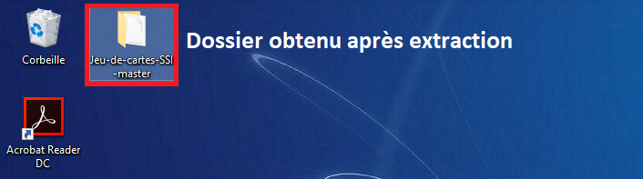

# Jeu-de-cartes-SSI
🎮 Jeu de cartes sur la sécurité des systèmes d'informations 🔐

# Comment jouer ?
- Cliquer sur "Clone or download" puis "Download ZIP"
- Une fois téléchargé, extraier le fichier ZIP et vous devez obtenir un dossier comme celui ci-dessous.

- Choisir la plateforme à partir de laquelle de le jeu est lancé.
- Profiter

##Pour les utilisateurs d'Android, placer le fichier .apk (se trouvant dans le dossier "Android") sur un téléphone Android puis l'installer à partir du téléphone

